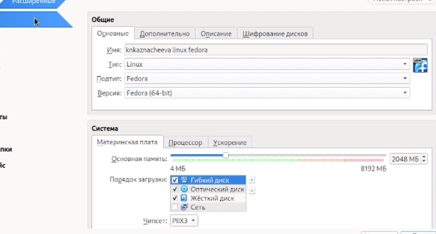
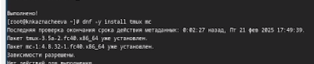
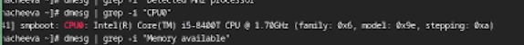

---
## Front matter
lang: ru-RU
title: Лабораторная работа №1
subtitle: Установка и конфигурация операционной системы на виртуальную машину
author:
  - Казначеева Кристина Никитична
institute:
  - НММ-02-24
date: 05 марта 2024

## i18n babel
babel-lang: russian
babel-otherlangs: english

## Formatting pdf
toc: false
toc-title: Содержание
slide_level: 2
aspectratio: 169
section-titles: true
theme: metropolis
header-includes:
 - \metroset{progressbar=frametitle,sectionpage=progressbar,numbering=fraction}
---

# Информация

## Докладчик

:::::::::::::: {.columns align=center}
::: {.column width="70%"}

  * Казначеева Кристина Никитична
  * Студент факультета физико-математических и естественных наук
  * Российский университет дружбы народов
  * [1132246773@pfur.ru](mailto:1132246773@pfur.ru)

:::
::: {.column width="30%"}

:::
::::::::::::::

# Вводная часть

## Актуальность
Современная IT-индустрия требует глубокого знания Linux. Этот курс предоставляет фундаментальные навыки работы в Linux-окружении для разработки, администрирования, тестирования, исследований и создания технической документации (Markdown, TeX Live), используя VirtualBox для упрощения обучения и экспериментов. Это закладывает основу для дальнейшего изучения Linux и смежных технологий.

## Объект и предмет исследования

Практическое руководство по установке и настройке Linux на VirtualBox, включая этапы установки, конфигурирование системы (автообновление, SELinux, раскладка клавиатуры), а также установку необходимого ПО (Markdown, TeX Live) для создания рабочей среды.
## Цели и задачи

Установка операционной системы Linux на виртуальной машине VirtualBox с последующей установкой инструментов для работы с Markdown и TeX Live.

## Материалы и методы

Данная работа включает в себя следующие этапы: установка графического дистрибутива Linux в VirtualBox, настройка системы через командную строку (автообновление, SELinux, раскладка клавиатуры), установка Markdown и TeX Live с помощью менеджера пакетов (apt/dnf) и тестирование работоспособности установленного ПО с помощью тестовых документов.

# Выполнение работы

## Работа в VirtualBox

Запустим терминал, перейдя в каталог /var/tmp и создадим каталог с именем пользователя. Проведём настройку папки в VirtualBox и создадим виртуальную машину с необходимыми
настройками. Выберем язык интерфейса.

:::::::::::::: {.columns align=center}
::: {.column width="50%"}

{#fig:102 width=50%}

:::
::: {.column width="50%"}

{#fig:103 width=50%}

:::
::::::::::::::

## Запустим виртуальную машину

При установке необходимых настроек укажем имя виртуальной машины, тип операционной системы и т.д. Войдём в ОС под заданной при установке учётной записью. Нажмём комбина-
цию Win+Enter для запуска терминала

:::::::::::::: {.columns align=center}
::: {.column width="50%"}

{#fig:105 width=70%}

:::
::: {.column width="50%"}

{#fig:109 width=70%}

:::
::::::::::::::

## Обновление всех пакетов

Переключимся на роль супер-пользователя, а затем обновим все пакеты. 

:::::::::::::: {.columns align=center}
::: {.column width="50%"}

{#fig:110 width=70%}

:::
::: {.column width="50%"}

{#fig:111 width=70%}

:::
::::::::::::::

## Автоматическое обновление

Установим программное обеспечение для удобства работы в консоли, включая средства для автоматического обновления системы.
:::::::::::::: {.columns align=center}
::: {.column width="50%"}

{#fig:112 width=70%}

:::
::: {.column width="50%"}

{#fig:113 width=70%}

:::
::::::::::::::

## Отключение SELinux

Отключим SELinux.

{#fig:130 width=70%}

## Настройка раскладки клавиатуры

Создадим конфигурационный файл ~/.config/sway/config.d/95-system-keyboard-
config.conf и отредактируем его.

{#fig:116 width=70%}

## Установка имени пользователя

Создадим пользователя, а позже зададим пароль для пользователя.

:::::::::::::: {.columns align=center}
::: {.column width="50%"}

{#fig:119 width=70%}

:::
::: {.column width="50%"}

{#fig:120 width=70%}

:::
::::::::::::::

## Установка названия хоста

Установим имя хоста и проверим, что имя хоста установлено верно.

{#fig:121 width=50%}

## Установка программного обеспечения для создания документации и установка texlive

Установим средство pandoc и pandoc-crossref для работы с языком разметки Markdown.Затем установим texlive.
:::::::::::::: {.columns align=center}
::: {.column width="50%"}

{#fig:122 width=70%}

:::
::: {.column width="50%"}

{#fig:123 width=70%}

## Домашнее задание 

Получим информацию о версии ядра Linux (Linux version) и модели процессора (CPU0) с помощью greb.

:::::::::::::: {.columns align=center}
::: {.column width="50%"}

{#fig:124 width=70%}

:::
::: {.column width="50%"}

{#fig:125 width=70%}

:::
::::::::::::::

## Домашнее задание 

С помощью grep получим информацию о частоте процессора (Detected Mhz processor) и о объёме доступной оперативной памяти (Memory available).

:::::::::::::: {.columns align=center}
::: {.column width="50%"}

{#fig:126 width=70%}

:::
::: {.column width="50%"}

{#fig:127 width=70%}

:::
::::::::::::::

## Домашнее задание 

С помощью grep получим информацию о типе файловой системы корневого раздела и последовательности монтирования файловых систем.

:::::::::::::: {.columns align=center}
::: {.column width="50%"}

{#fig:128 width=70%}

:::
::: {.column width="50%"}

{#fig:129 width=70%}

:::
::::::::::::::

# Результаты

## Выводы

 Результатом работы стало создание полностью функциональной среды разработки на базе Linux в VirtualBox. Были успешно освоены навыки установки операционной системы, её базовой настройки, установки необходимого программного обеспечения (Markdown, TeX Live), работы в командной строке и управления пакетами.

## Спасибо за внимание

Спасибо за внимание!
