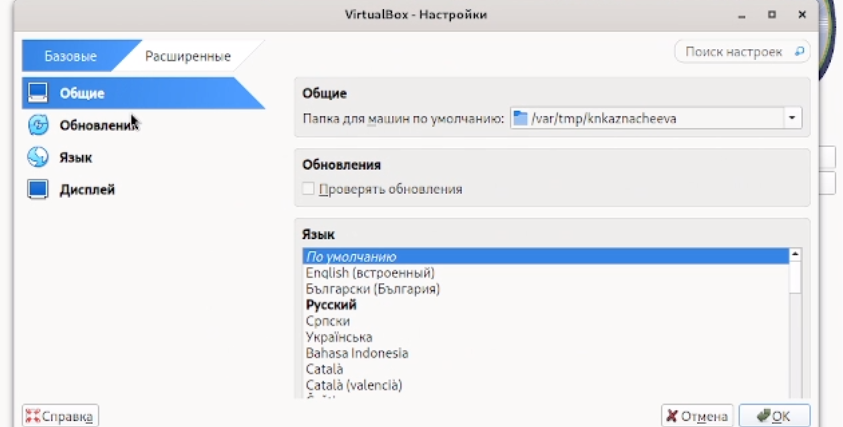
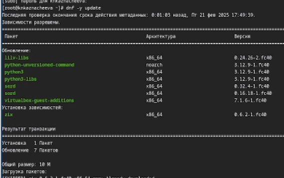
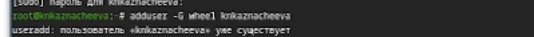
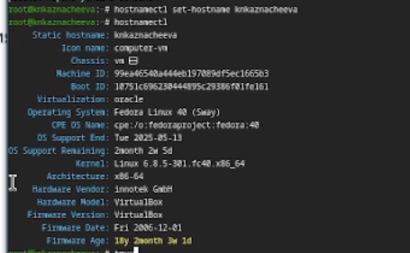
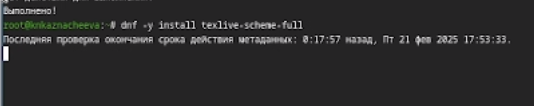

---
## Front matter
title: "Лабораторная работа №1"
subtitle: "Операционные системы"
author: "Казначеева Кристина Никитична"

## Generic otions
lang: ru-RU
toc-title: "Содержание"

## Bibliography
bibliography: bib/cite.bib
csl: pandoc/csl/gost-r-7-0-5-2008-numeric.csl

## Pdf output format
toc: true # Table of contents
toc-depth: 2
fontsize: 12pt
linestretch: 1.5
papersize: a4
documentclass: scrreprt
## I18n polyglossia
polyglossia-lang:
  name: russian
  options:
	- spelling=modern
	- babelshorthands=true
polyglossia-otherlangs:
  name: english
## I18n babel
babel-lang: russian
babel-otherlangs: english
## Fonts
mainfont: IBM Plex Serif
romanfont: IBM Plex Serif
sansfont: IBM Plex Sans
monofont: IBM Plex Mono
mathfont: STIX Two Math
mainfontoptions: Ligatures=Common,Ligatures=TeX,Scale=0.94
romanfontoptions: Ligatures=Common,Ligatures=TeX,Scale=0.94
sansfontoptions: Ligatures=Common,Ligatures=TeX,Scale=MatchLowercase,Scale=0.94
monofontoptions: Scale=MatchLowercase,Scale=0.94,FakeStretch=0.9
mathfontoptions:
## Biblatex
biblatex: true
biblio-style: "gost-numeric"
biblatexoptions:
  - parentracker=true
  - backend=biber
  - hyperref=auto
  - language=auto
  - autolang=other*
  - citestyle=gost-numeric
## Pandoc-crossref LaTeX customization
figureTitle: "Рис."
tableTitle: "Таблица"

## Misc options
indent: true
header-includes:
  - \usepackage{indentfirst}
  - \usepackage{float} # keep figures where there are in the text
  - \floatplacement{figure}{H} # keep figures where there are in the text
---

# Цель работы
  Эта работа посвящена получению практических навыков установки операционной системы на виртуальную машину, а также конфигурированию минимально необходимых сервисов для последующей эффективной работы.
# Задание

Заданием лабораторной работы является получение практических навыков по установке Linux на Virtualbox, настройке базовой конфигурации (раскладка клавиатуры, имена пользователя и хоста), инсталляции ПО для создания документации и анализу логов загрузки системы с помощью команды dmesg

# Выполнение лабораторной работы

Запустим терминал, перейдя в каталог /var/tmp (рис. [-@fig:101]).

{#fig:101 width=70%}

Создадим каталог с именем пользователя (рис. [-@fig:102]).

{#fig:102 width=70%}

В меню выберем Файл, Настройки, затем выберем Общие, поле Папка для машин по умолчанию,
установим новое значение (рис. [-@fig:103]).

{#fig:103 width=70%}

Выберем Ввод, вкладку Виртуальная машина, Сочетание клавиш в строке Хост-комбинация.
Нажмём новое сочетание клавиш "левый Ctrl" (рис. [-@fig:104]).

{#fig:104 width=70%}

Укажем имя виртуальной машины, тип операционной системы — Linux, Fedora (рис. [-@fig:105]).

{#fig:105 width=70%}

кажем размер основной памяти виртуальной машины — от 2048 МБ (рис. [-@fig:106]).

{#fig:106 width=70%}

Зададим конфигурацию жёсткого диска — загрузочный, VDI (VirtualBox Disk Image), динамический виртуальный диск, затем зададим размер диска — 80 ГБ (рис. [-@fig:107]).

{#fig:107 width=70%} 

В качестве графического контроллера поставим VMSVGA и включим ускорение 3D (рис. [-@fig:108]).

{#fig:108 width=70%}

Войдём в ОС под заданной при установке учётной записью.
Нажмём комбинацию Win+Enter для запуска терминала (рис. [-@fig:109]).

{#fig:109 width=70%}

Переключимся на роль супер-пользователя (рис. [-@fig:110]).

{#fig:110 width=70%}

Обновим все пакеты (рис. [-@fig:111]).

{#fig:111 width=70%}

Программы для удобства работы в консоли (рис. [-@fig:112]).

{#fig:112 width=70%}

Установим программное обеспечение (рис. [-@fig:113]).

{#fig:113 width=70%}

Зададим необходимую конфигурацию в файле /etc/dnf/automatic.conf. Запустим таймер (рис. [-@fig:114]).

{#fig:114 width=70%}

Запустим терминальный мультиплексор tmux (рис. [-@fig:115]).

{#fig:115 width=70%}

Создадим конфигурационный файл ~/.config/sway/config.d/95-system-keyboard-config.conf и отредактируем его (рис. [-@fig:116]).

{#fig:116 width=70%}

Переключимся на роль супер-пользователя (рис. [-@fig:117])

{#fig:117 width=70%}

Отредактируем конфигурационный файл /etc/X11/xorg.conf.d/00-keyboard.conf (рис. [-@fig:118]).

{#fig:118 width=70%} 

Переключимся на роль супер-пользователя и создадим пользователя (рис. [-@fig:119]).

{#fig:119 width=70%}

Зададим пароль для пользователя (рис. [-fig:120])

{#fig:120 width=70%}

Установим имя хоста  и проверим, что имя хоста установлено верно (рис. [-@fig:121]).

{#fig:121 width=70%}

Средство pandoc для работы с языком разметки Markdown. Установим с помощью менеджера пакетов (рис. [-@fig:122]).

{#fig:122 width=70%} 

Установим дистрибутив TeXlive (рис. [-@fig:123]).

{#fig:123 width=70%}

Домашнее задание:
Дождиёмся загрузки графического окружения и откроем терминал. В окне терминала проанализируем последовательность загрузки системы, выполнив команду dmesg. Можно просто просмотреть вывод этой команду с помощью grep:
dmesg | grep -i "..."

Получим следующую информацию:
Версия ядра Linux (Linux version) (рис. [-@fig:124]).

{#fig:124 width=70%}

 Модель процессора (CPU0) (рис. [-@fig:125]).

{#fig:125 width=70%}

Частота процессора (Detected Mhz processor) (рис. [-@fig:126])

{#fig:126 width=70%}

Объём доступной оперативной памяти (Memory available) (рис. [-@fig:127]).

{#fig:127 width=70%} 

Тип файловой системы корневого раздела (рис. [-@fig:128]).

{#fig:128 width=70%}

Последовательность монтирования файловых систем (рис. [-fig:120])

{#fig:129 width=70%}

# Выводы

В данной лабораторной работе мы установили Linux на Virtualbox, настроили раскладку клавиатуры, имя пользователя и имя хоста, установили программное обеспечение для создания документации и проанализировали последовательность загрузки системы с помощью команды dmesg.

